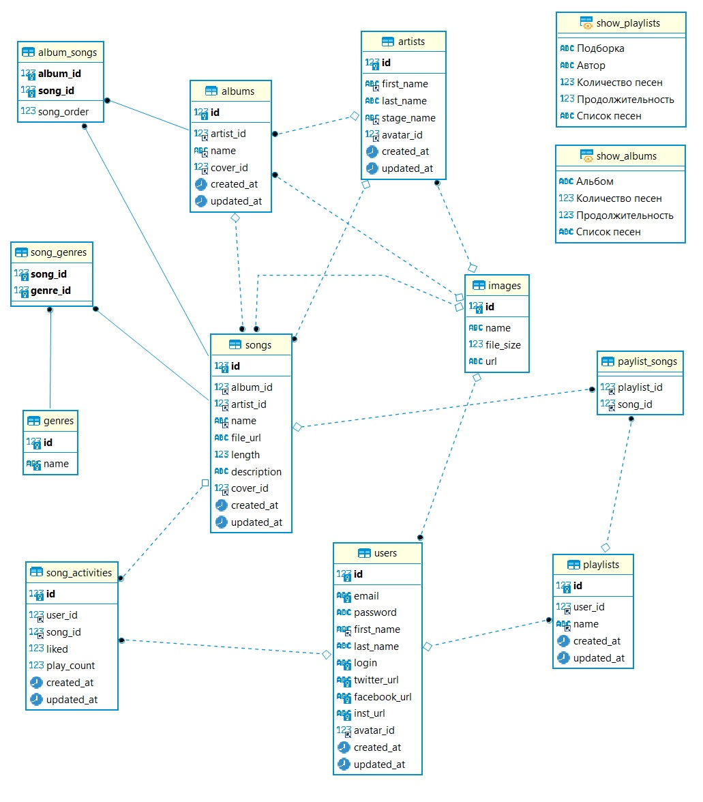

# Курсовой проект по курсу "Основы реляционных баз данных. MySQL"

---

## Проектирование БД сервиса "Spotify"

_Spotify — это шведский музыкальный сервис, доступный почти в 120 странах. В его каталоге больше 50 миллионов песен и 4 миллиарда плейлистов с треками русских и международных исполнителей. Сервисом можно пользоваться в вебе, на десктопах, мобильных устройствах, игровых консолях, телевизорах и стереосистемах._

---

### Файлы

| Файл                                 | Назначение             |
| ------------------------------------ | ---------------------- |
| _[ddl.sql](./ddl.sql)_               | ddl таблиц БД          |
| _[dummy_data.sql](./dummy_data.sql)_ | тестовые данные таблиц |
| _[schema.jpg](./schema.jpg)_         | ERDiagram для БД       |
| _[procs.sql](./procs.sql)_           | Процедуры              |
| _[views.sql](./views.sql)_           | Представления          |
| _[triggers.sql](./triggers.sql)_     | Триггеры               |

---

### ERDiagram

---

### Требования к курсовому проекту:

- Составить общее текстовое описание БД и решаемых ею задач;
  минимальное количество таблиц - 10;
- скрипты создания структуры БД (с первичными ключами, индексами, внешними ключами);
- создать ERDiagram для БД;
- скрипты наполнения БД данными;
- скрипты характерных выборок (включающие группировки, JOIN'ы, вложенные таблицы);
- представления (минимум 2);
- хранимые процедуры / триггеры;
